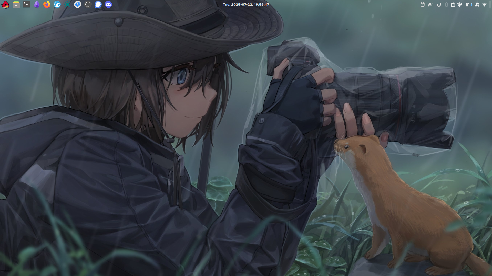
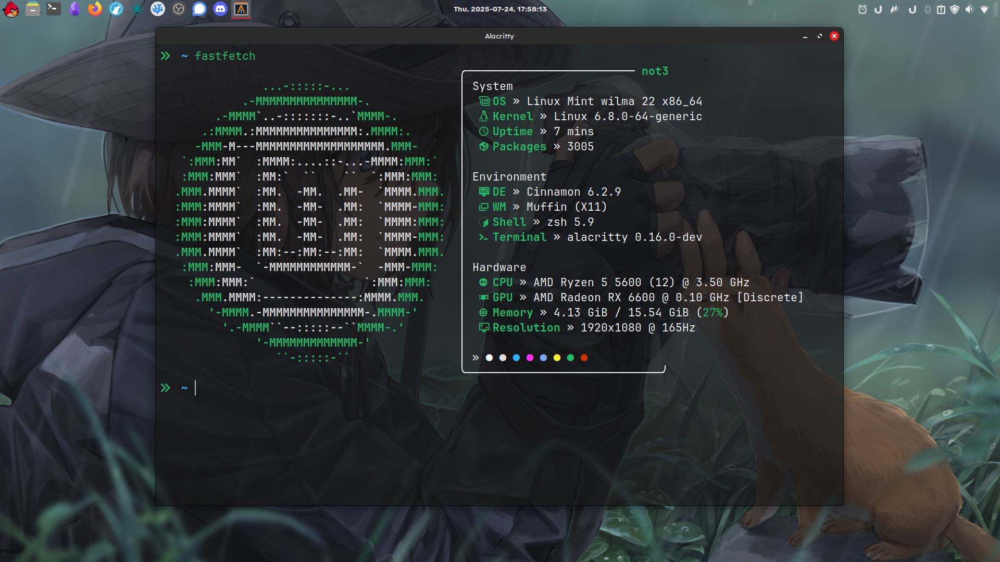

# dotfiles
my own dotfiles

# general configs
- OS: [Linux Mint](https://www.linuxmint.com/) `it just works!`
- Shell: [zsh](https://zsh.sourceforge.io/)
- Terminal: [alacritty](https://alacritty.org/)
- Fetch: [fastfetch](https://github.com/fastfetch-cli/fastfetch)
- Code Editor: [VSCodium](https://vscodium.com/) `currently using`
- Text Editor: [Neovim](https://neovim.io/) `learning rn`
- Theme: [tokyo night](https://github.com/tokyo-night/tokyo-night-vscode-theme) `amazing dark theme`
- Font: [JetBrainsMono Nerd Font](https://www.nerdfonts.com/) `favourite font`

# screenshots

 
