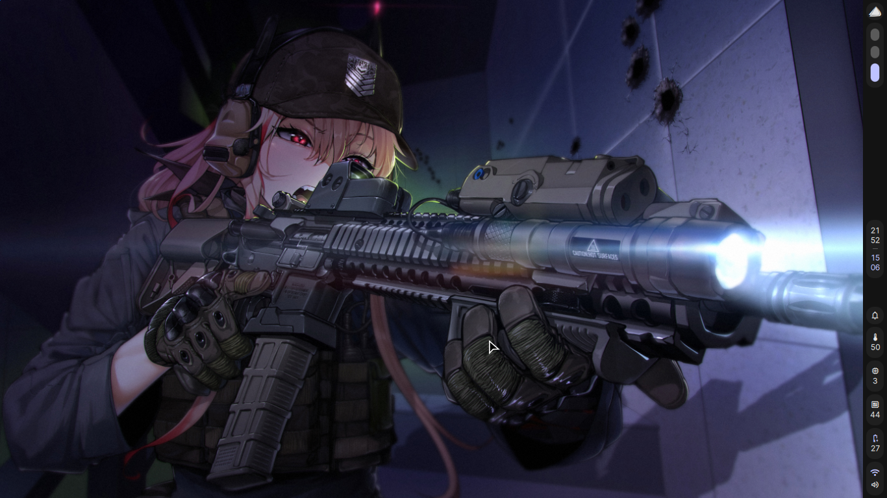
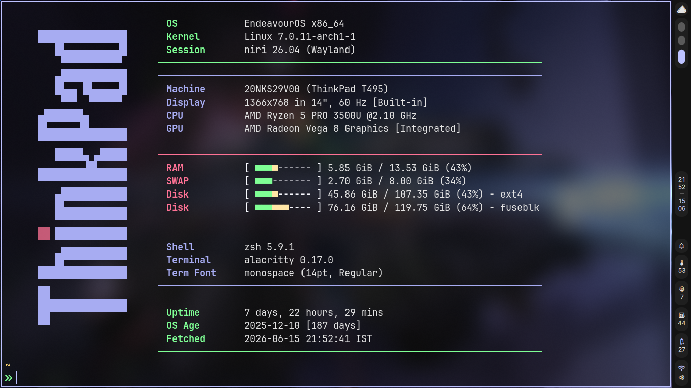
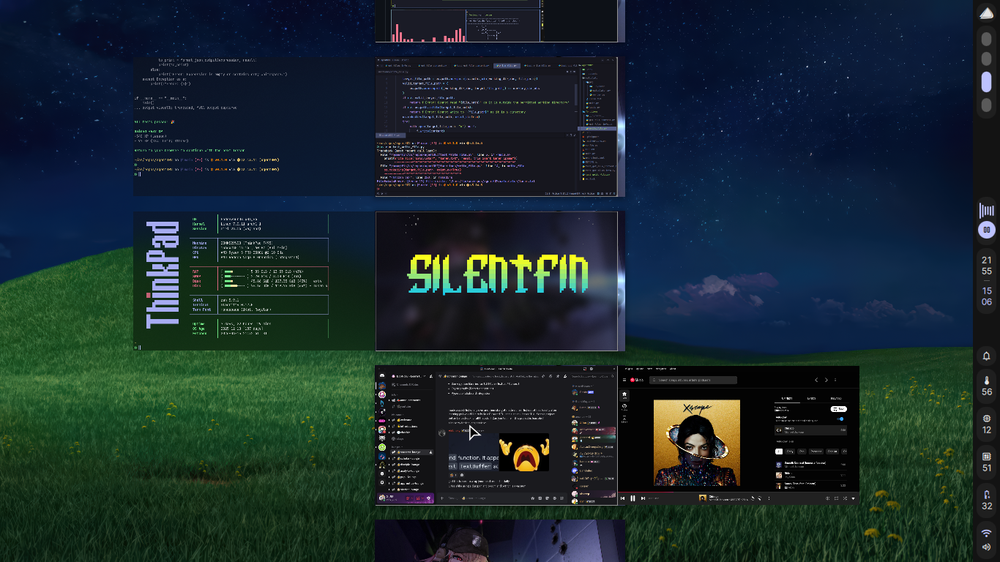

# dotfiles
I use EndeavourOS with Niri & DankMaterialShell.

- **Terminal**: Alacritty, Kitty
- **Editor**: Zed, Neovim
- **Font**: JetBrainsMono Nerd Font

## current niri config

### my previous x11 branch [here](https://github.com/silentfin/dotfiles/tree/x11)
