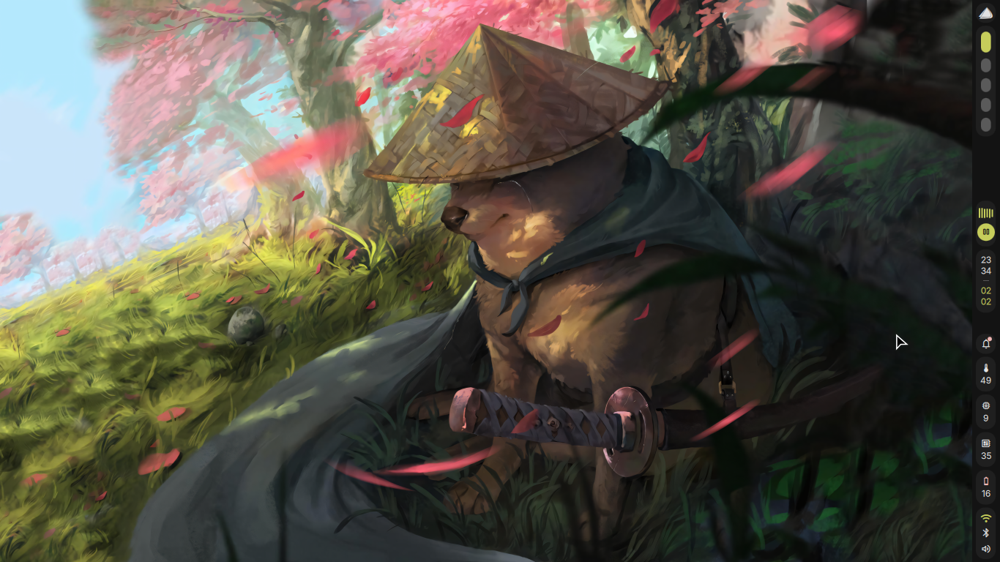
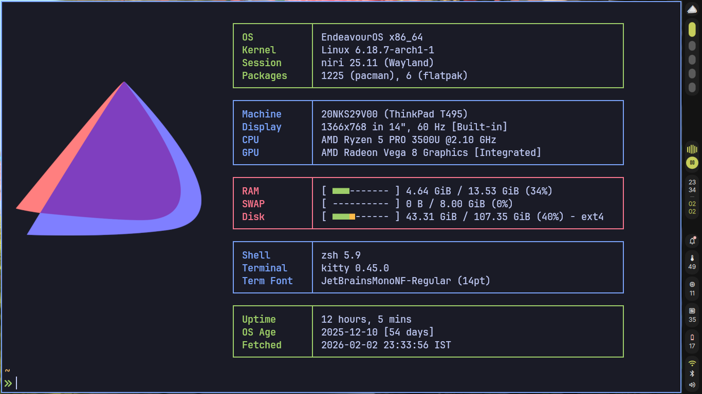
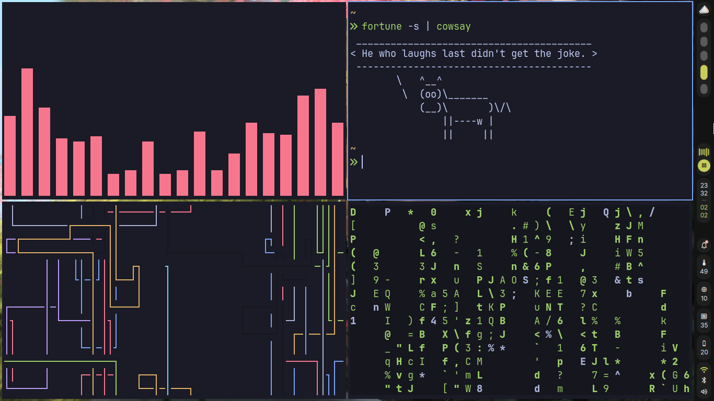
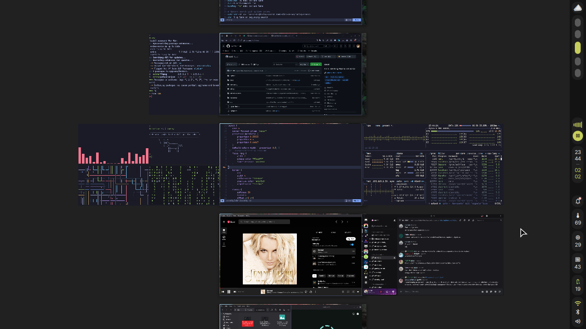

# dotfiles
I use EndeavourOS with Niri as the Wayland Compositor, with DankMaterialShell.

## current niri config

## What's Inside

- **Wayland Compositor**: Niri
- **Desktop Shell**: DankMaterialShell
- **Display Server**: Wayland
- **Terminal**: Alacritty, Kitty
- **Dock**: DMS
- **Font**: JetBrainsMono Nerd Font
- **Editor**: Codium, Neovim

### my previous x11 branch [here](https://github.com/silentfin/dotfiles/tree/x11)